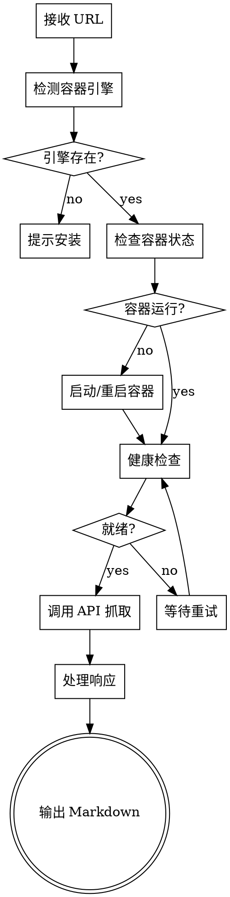

# crawl4ai 网页抓取 Skill

## 使用原则

1. 自动管理容器生命周期（检测、启动、健康检查）
2. 默认启用 JS渲染和反爬虫处理
3. 使用 fit 模式过滤噪音内容
4. 处理各种异常情况并给出清晰提示
5. 默认输出到终端，可选保存到 md 文件

## 工作流程



## 触发示例

**应该触发：**
- "抓取 https://example.com 的内容"
- "爬取这个网页"
- "获取 https://zhihu.com/question/xxx 的正文"
- "/crawl4ai https://example.com"

**不应该触发：**
- "帮我写一个爬虫脚本"
- "如何抓取网页数据"

## 详细步骤

### 步骤 1: URL预处理

1. 检查 URL 是否有效
2. 自动补全协议：`example.com` → `https://example.com`
3. 提取可选参数：`--wait=N`、`--selector=CSS`、`--raw`、`--save`

### 步骤 2: 容器管理

读取 `references/container.md`，执行容器检测和启动流程。

### 步骤 3: API 调用

读取 `references/api-endpoints.md`，构造请求并调用：

```bash
curl -X POST http://127.0.0.1:11235/md \
  -H "Content-Type: application/json" \
  -d '{"url": "<URL>", "f": "fit", "wait_for": 2}'
```

### 步骤 4: 结果处理

- 成功：输出 Markdown 内容到终端
- 内容过大（>100KB）：警告并可选截断
- 内容为空：提示可能需要调整参数
- 错误：根据错误类型给出具体提示

### 步骤 5: 保存提示

抓取完成后询问用户是否需要保存到 md 文件：
- 如果用户指定 `--save` 参数，直接保存
- 如果用户指定 `--save <filename>`，保存到指定文件
- 否则询问用户是否需要保存

## 参数说明

| 参数 | 说明 | 示例 |
|------|------|------|
| `--wait=N` | 自定义等待 JS 渲染时间 | `--wait=5` |
| `--selector=CSS` | 指定抓取特定部分 | `--selector=".article"` |
| `--raw` | 禁用内容过滤 | `--raw` |
| `--save` | 保存到 md 文件（自动命名） | `--save` |
| `--save <filename>` | 保存到指定文件 | `--save output.md` |

## 错误处理

| 错误类型 | 提示信息 |
|---------|---------|
| 无容器引擎 | "未检测到 podman 或 docker，请先安装" |
| 容器启动失败 | "容器启动失败：<错误详情>" |
| 健康检查超时 | "容器未就绪，请手动检查：$ENGINE logs crawl4ai" |
| URL 无效 | "URL 格式错误，请检查" |
| HTTP 403 | "页面拒绝访问，可能有反爬虫保护" |
| HTTP 404 | "页面不存在" |
| 内容为空 | "抓取内容为空，尝试使用 --raw 参数" |
| 内容过大 | "内容超过 100KB，建议分段处理" |

## 参考文档

- `references/container.md` - 容器管理详细逻辑
- `references/api-endpoints.md` - API 端点和参数说明